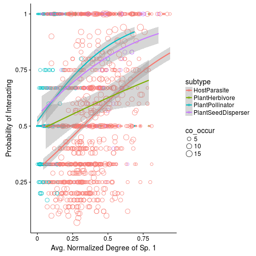
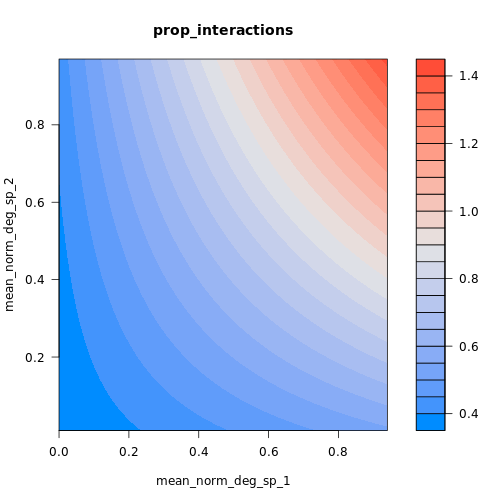

Generalized Linear Mixed-Effect Models (GLMMs) Tutorial
==========================================================
author: Matt Barbour
date: Oct. 18, 2017
width: 960
height: 700


Why Statistical Models?
=============================
- Want to measure or test the effect of factors on responses you are interested in
- Analyzing experimental or observational data


Arxhina's Question
========================================================

When two species co-occur, what determines their probability of interacting?
- **Type of Ecological Interaction**
- **Normalized Degree of each Species**
- **Statistical interactions** between Normalized Degree and Type of Ecological Interaction


Arxhina's Data
========================================================

- 4075 unique pairs of interactions


```
# A tibble: 10 × 3
   id_pair prop_interactions   type
    <fctr>             <dbl> <fctr>
1     3614              0.50      A
2     1970              1.00      M
3     3930              0.25      A
4       90              1.00      M
5     2100              0.50      M
6     2752              0.60      A
7     2098              1.00      M
8      450              0.50      M
9     1956              0.50      M
10     717              0.50      M
```

Arxhina's Data
========================================================

- 4075 unique pairs of interactions

```
# A tibble: 10 × 3
           subtype Norm.Deg.Sp.1 Norm.Deg.Sp.2
             <chr>         <dbl>         <dbl>
1     HostParasite          0.32          0.19
2  PlantPollinator          0.11          0.07
3     HostParasite          0.32          0.39
4  PlantPollinator          0.04          0.76
5  PlantPollinator          0.03          0.02
6     HostParasite          0.32          0.42
7  PlantPollinator          0.51          0.49
8  PlantPollinator          0.22          0.31
9  PlantPollinator          0.07          0.03
10 PlantPollinator          0.03          0.04
```

Possible Analysis
=========================
Analysis of Variance (ANOVA)
- Data points are independent (true for **ANY** statistical analysis)
- Residuals (error) are normally distributed
- Equality of variances


Explore the Data
=======================
- Is ANOVA okay?


Are unique pairwise interactions independent of each other?
===========================================================
- Many species occur in multiple interactions


Are unique pairwise interactions independent of each other?
===========================================================
- Bias toward Host-Parasite and Plant-Pollinator interactions


GLMMs to the Rescue 
===================

**Generalized Linear Models**
- Non-normal data okay (pick another error distribution)


GLMMs to the Rescue 
===================

**Mixed-Effect Models**
- Account for non-independence in the data
- **Fixed-effects**: factors whose effects are experimentally determined, or whose interest lies in the specific effects of each level.
- **Random Effects**: factors whose levels are sampled from a larger population, or whose interest lies in the variation among them rather than the specific effects of each level.
- Status of particular levels depends on experimental design and context.
- No need to aggregate data


Mixed-Model Example
==================
- Fixed-effect: Type of Ecological Interaction
- Random-effect: Subtype



Another Example 
=========================
- Is using the mean for normalized degree informative?


Generalized Linear Mixed-Effect Model
=====================================

**Probability of Interaction** ~ 

  **Type** x **Norm_Deg_Sp_1** x **Norm_Deg_Sp_2** +
  
  (1 | **Subtype**) + (1 | **Sp_1 ID**) + (1 | **Sp_2 ID**) + 
  
  (1 | **Network ID**) + (1 | **Interaxn ID**)
  
- Model complexity requires a Bayesian approach


How does a Bayesian approach help us fit a more complex model?
=============================================================
- Incorporate prior information
- But how do we choose a "good" prior?


Choosing Priors
================
*Have to think like the model*

- How does a 1 unit change in the predictor affect the log(odds) of an interaction? 

**Example**:
- Do mutualistic interactions *increase* or *decrease* the probability of an interaction?
- How big are these potential effects?


Example
=============
- pM = 0.75; pA = 0.25
- Model Coefficient = log(pM / (1-pM)) - log(pA / (1-pA))



Run the Model
==============
- Summary Plots


