Genearlized Linear Mixed-Effect Models (GLMMs)
========================================================
author: Matt Barbour
date: Oct. 18, 2017
autosize: true

When should I use a GLMMs?
========================================================

- Non-Normal Data
- Unbalanced, hierarchical data


Why are they called Generalized Linear Models?
==============================================
- Statistical models that assume errors from the exponential family.
- Data do not have to be normally distributed

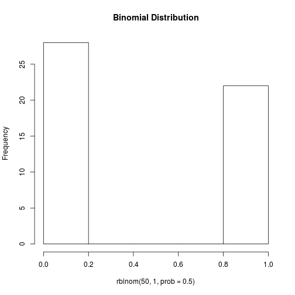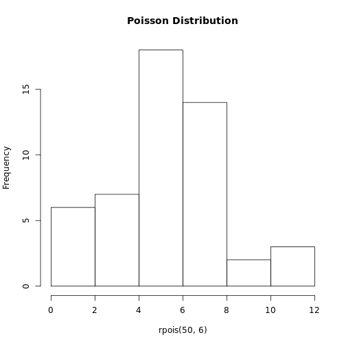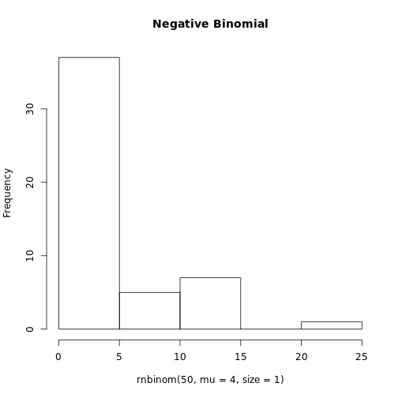


Why are they called Mixed-Effect Models?
========================================================

- Fixed Effects: factors whose effects are experimentally determined, or whose interest lies in the specific effects of each level. 
- Random Effects: factors whose levels are sampled from a larger population, or whose interest lies in the variation among them rather than the specific effects of each level.
- Status of particular levels depends on experimental design and context.


Arxhina's Question
========================================================

When two species co-occur, what determines their probability of interacting?

- Type of ecological interaction? Mutualistic vs. Antagonistic
- Normalized degree of a species? 

Possible ways to Analyze
=========================
- Two-sample t-test
- Kruskal-Wallis test


Arxhina's Data
========================================================


```
# A tibble: 10 x 5
   id_pair              species_1                 species_2   type
    <fctr>                  <chr>                     <chr> <fctr>
 1    3625         Neomys fodiens      Palaeopsylla soricis      A
 2    2718        Allactaga major Ophthalmopsylla volgensis      A
 3    1367      Potentilla erecta        Calameuta pallipes      M
 4    1346 Senecio bustillosianus          Andinus venustus      M
 5    3436  Meriones tamariscinus        Stenoponia vlasovi      A
 6    1527           Salix repens         Dilophus febrilis      M
 7     617      Galium propinquum           Proscissio cana      M
 8    2004       Trifolium repens            Bombus lucorum      M
 9    2342     Crataegus monogyna                 Pica pica      M
10    2914     Apodemus uralensis         Neopsylla pleskei      A
# ... with 1 more variables: connected <int>
```

```
# A tibble: 10 x 5
   id_pair normalized_degree_sp_1 normalized_degree_sp_2
    <fctr>                  <dbl>                  <dbl>
 1    3625                 0.1154                 0.7692
 2    2718                 0.0769                 0.0714
 3    1367                 0.3178                 0.1000
 4    1346                 0.1563                 0.0930
 5    3436                 0.0556                 0.1250
 6    1527                 0.4032                 0.1053
 7     617                 0.1500                 0.1111
 8    2004                 0.1429                 0.0513
 9    2342                 0.7857                 0.1111
10    2914                 0.0769                 0.2857
# ... with 2 more variables: subtype <chr>, network_id <fctr>
```


Arxhina's Data
========================================================


```
# A tibble: 10 x 3
   id_pair prop_interactions   type
    <fctr>             <dbl> <fctr>
 1    3593              1.00      A
 2    3102              0.64      A
 3    1763              0.75      M
 4    2919              0.33      A
 5    1030              0.50      M
 6    2837              0.22      A
 7    3267              0.50      A
 8     957              1.00      M
 9    1287              0.33      M
10    1929              1.00      M
```

```
# A tibble: 10 x 3
   id_pair mean_norm_deg_sp_1 mean_norm_deg_sp_2
    <fctr>              <dbl>              <dbl>
 1    3593               0.49               0.32
 2    3102               0.74               0.30
 3    1763               0.06               0.44
 4    2919               0.48               0.44
 5    1030               0.07               0.09
 6    2837               0.42               0.38
 7    3267               0.23               0.30
 8     957               0.34               0.03
 9    1287               0.01               0.05
10    1929               0.02               0.19
```


Is Arxhina's Data Normally Distributed?
=======================================

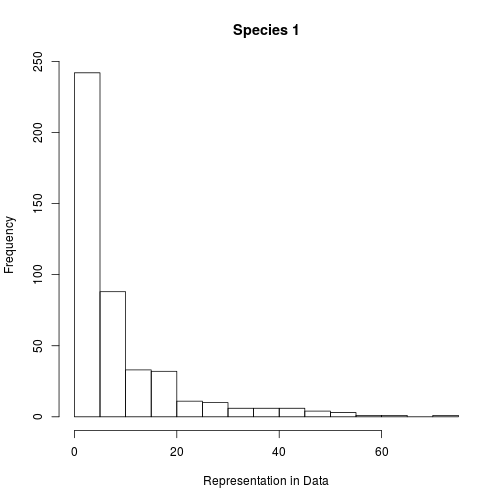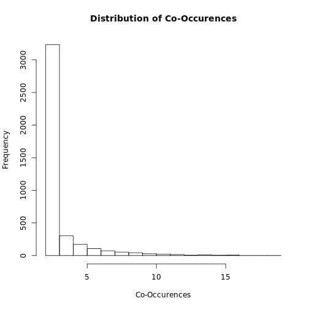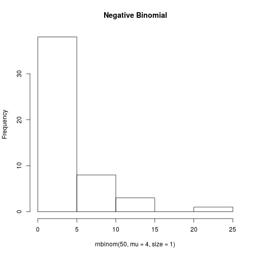

Is it balanced?
===============
- Pseudo-Replication
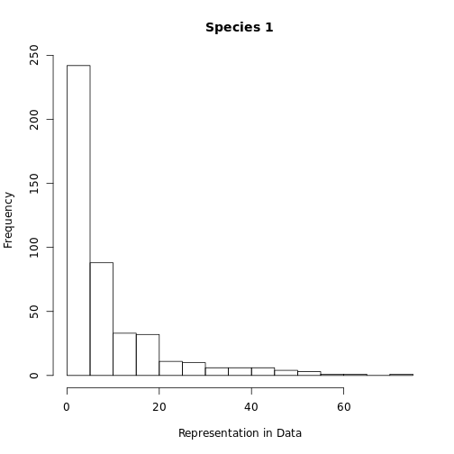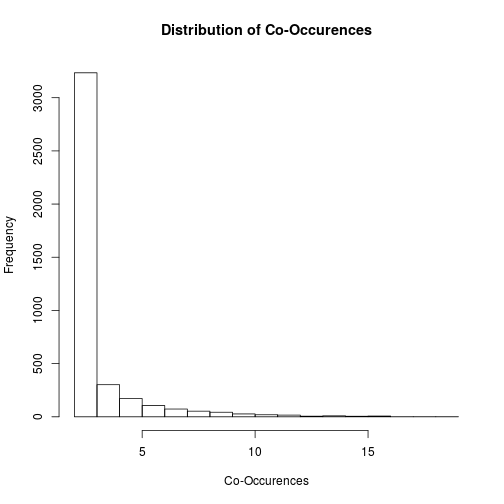

Other Problems
===============
- Pseudo-Replication at the network level
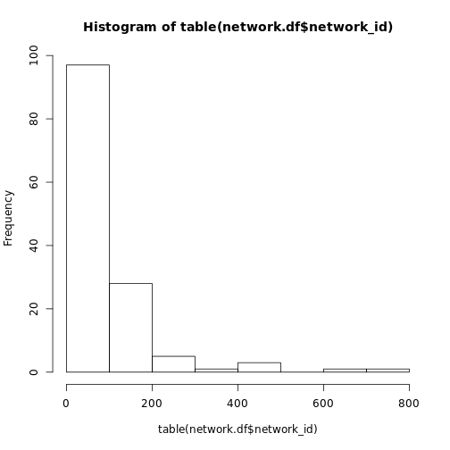


Other Problems
===============
- Pseudo-Replication

```
   
    HostParasite PlantHerbivore PlantPollinator PlantSeedDisperser
  A         1403            202               0                  0
  M            0              0            2125                345
```

Exploring the Data
========================================================

How do interaction type and normalized degree influence the probability of an interaction?

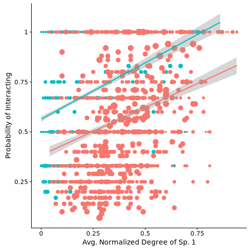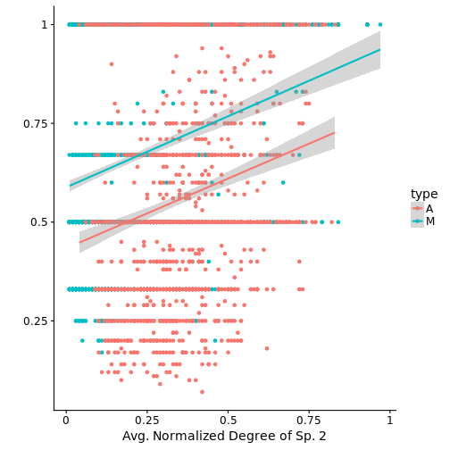

GLMs
=====

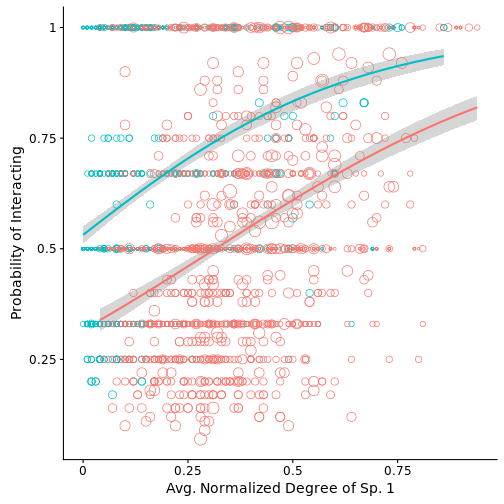


Analysis with a linear model
========================================================


```
                                       Factor Estimate CI.025 CI.975
1                                 (Intercept)     0.35   0.29   0.42
2                                       typeM     0.17   0.10   0.23
3                          mean_norm_deg_sp_1     0.19   0.04   0.35
4                          mean_norm_deg_sp_2     0.07  -0.09   0.23
5                    typeM:mean_norm_deg_sp_1     0.42   0.23   0.60
6                    typeM:mean_norm_deg_sp_2     0.24   0.06   0.43
7       mean_norm_deg_sp_1:mean_norm_deg_sp_2     0.90   0.49   1.30
8 typeM:mean_norm_deg_sp_1:mean_norm_deg_sp_2    -1.40  -1.91  -0.89
  P_value
1   0.000
2   0.000
3   0.016
4   0.382
5   0.000
6   0.010
7   0.000
8   0.000
```


Visualize the 3-way Interaction
===============================
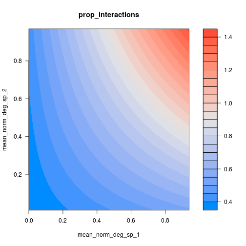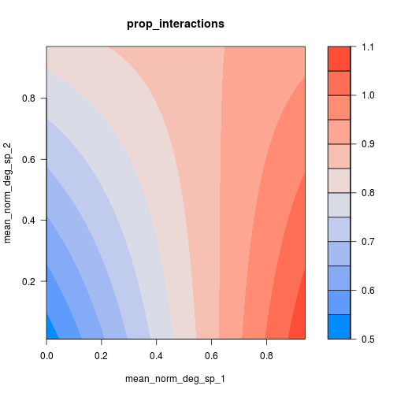


Analysis Assumptions Met?
=========================
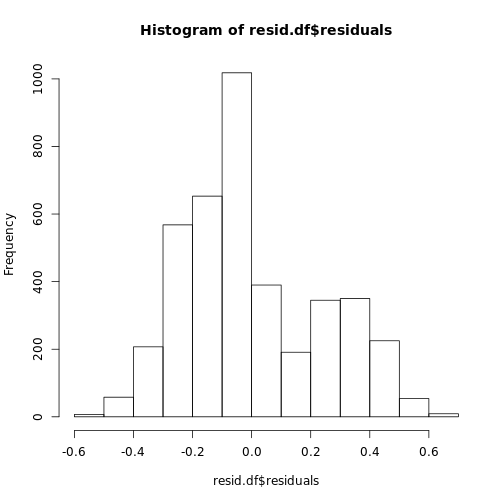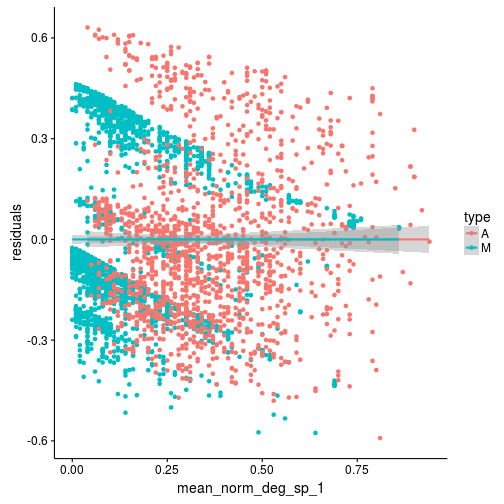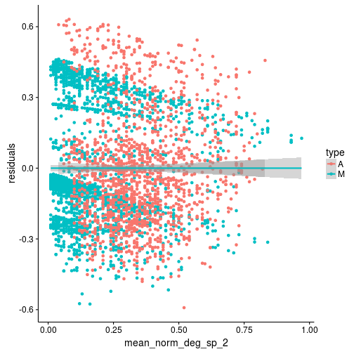


Variability in Normalized Degree
========================================================

- Is using the mean informative?

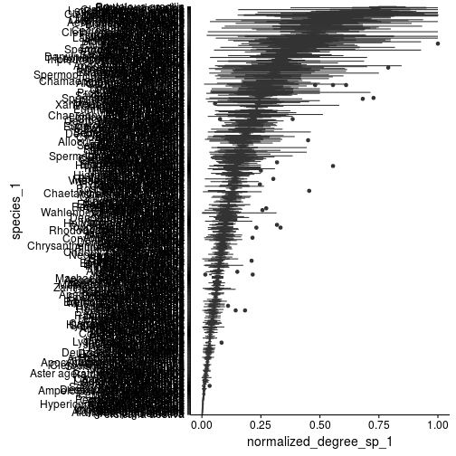


Generalized Linear Mixed-Effect Model
=====================================


```
Error in library(brms) : there is no package called 'brms'
```
